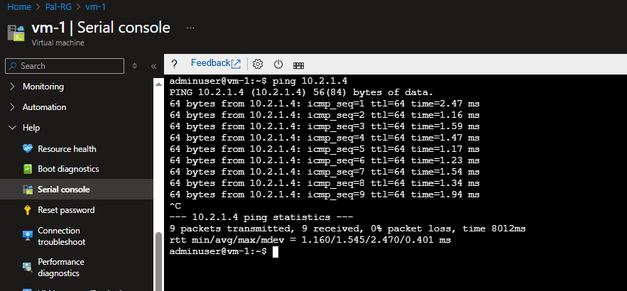
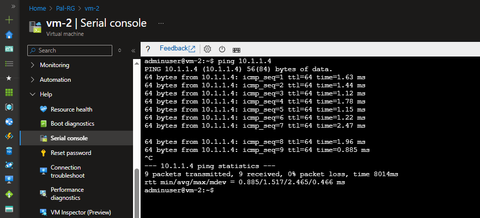
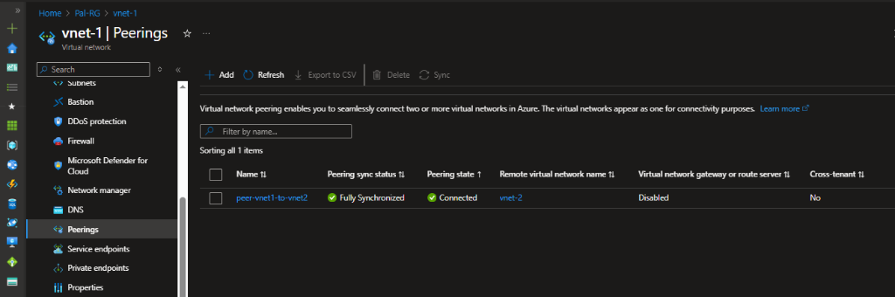
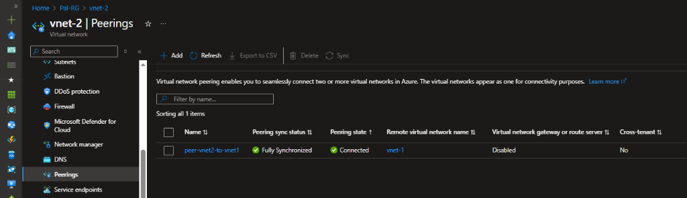

# Azure VNet Peering PoC with Terraform

This project demonstrates how to set up **VNet Peering** between two Azure Virtual Networks using **Terraform**. It deploys two Linux VMs in separate VNets and verifies connectivity using ICMP (Ping), proving that traffic flows privately between the networks.

## Architecture

*   **VNet 1**: `10.1.0.0/16`
    *   **Subnet 1**: `10.1.1.0/24`
    *   **VM 1**: Ubuntu 22.04 LTS
*   **VNet 2**: `10.2.0.0/16`
    *   **Subnet 2**: `10.2.1.0/24`
    *   **VM 2**: Ubuntu 22.04 LTS
*   **Peering**: Bidirectional peering between VNet 1 and VNet 2.

## Prerequisites

*   [Terraform](https://www.terraform.io/downloads) installed.
*   [Azure CLI](https://docs.microsoft.com/en-us/cli/azure/install-azure-cli) installed and logged in (`az login`).
*   An active Azure Subscription.

## Usage

1.  **Initialize Terraform**:
    ```bash
    terraform init
    ```

2.  **Review the Plan**:
    ```bash
    terraform plan
    ```

3.  **Apply Configuration**:
    ```bash
    terraform apply -auto-approve
    ```

4.  **Verify Connectivity**:
    *   SSH into **VM 1** using the public IP from the output:
        ```bash
        ssh adminuser@<vm1-public-ip>
        ```
    *   Ping the private IP of **VM 2** (also in the output):
        ```bash
        ping <vm2-private-ip>
        ```

5.  **Clean Up**:
    ```bash
    terraform destroy -auto-approve
    ```

---

## 📸 Verification Screenshots

### 1. The "Success" Ping (VM1 -> VM2)
**VM1** (10.1.1.4) successfully pinging **VM 2** (10.2.1.4).


### 2. The Return Ping (VM2 -> VM1)
**VM2** (10.2.1.4) successfully pinging **VM 1** (10.1.1.4).


### 3. Azure Portal Peering Status
**VNet 1** showing "Connected" status.


**VNet 2** showing "Connected" status.



